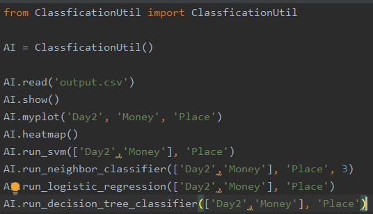

## 인공지능 과제

### 데이터를 수집하고 인공지능 알고리즘 적용시켜보기.
- 실습 목적 : 일정 정보가 주어졌을때 사용자가 어떤 음식점을 갔는지 맞추기.

#### 1. 데이터
- 수집 데이터 : 카드 사용내역중, 음식점을 방문한 데이터를 수집했습니다.

- 수집 내용 : 금액, 일자, 시간, 장소 -> 문자 내역에서 수집했습니다.

- 

  - 결제 문자 크롤링을 위한 어플을 이용하여 데이터를 수집, csv파일로 저장.

br/
br/
br/

- 분석 요소 추가 : 날씨, 온도
- 위의 요소들만으로는 상관관계가 부족하다고 판단되어 추가.
- 
- 네이버 지도를 이용하였습니다.


#### 2. 실습

  


- ```python
  from ClassficationUtil import ClassficationUtil

  AI = ClassficationUtil()
  ```
- import 모듈은 강의시간에 사용한 모듈을 그대로 사용하였습니다.


- ```python
  AI.read('output.csv')
  AI.show()
  ```
- 
- csv파일을 읽어오고 정보 및 5줄을 표시합니다.


- ```python
  AI.heatmap()
  ```
- 
- heatmap을 출력합니다.
- 데이터 양의 부족 및 적절한 요소 선정 실패로 인해 상관관계가 낮습니다.


- ```python
  AI.run_svm(['Day2','Money'], 'Place')
  AI.run_neighbor_classifier(['Day2','Money'], 'Place', 3)
  AI.run_logistic_regression(['Day2','Money'], 'Place')
  AI.run_decision_tree_classifier(['Day2','Money'], 'Place')
  ```
- 
- 4가지 알고리즘을 요일, 금액으로 분석하여 실행해본 결과입니다.
- svm은 가장 인식률이 떨어집니다.
- neighbor-classifier 역시 인식률이 떨어집니다.
- 나머지 두 알고리즘은 그나마 인식률이 나옵니다.
- 요일을 제외한 다른 분석요소들의 상관관계가 너무 떨어져서 대체로 높은 인식률을 보이지 못하는 모습입니다.

